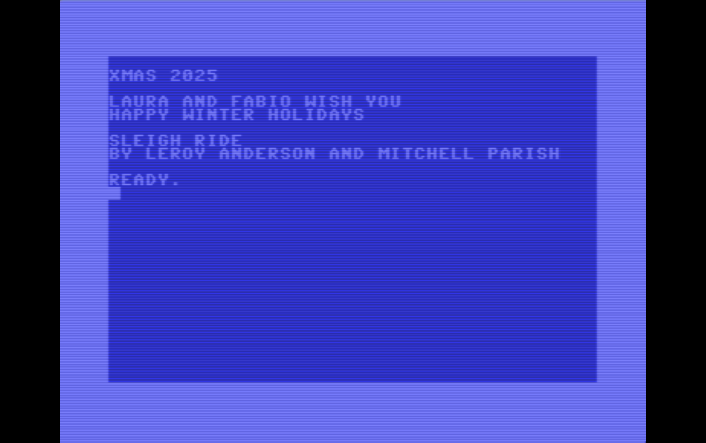

# THEC64 Player XMAS2025

A polyphonic music player for the Commodore 64 featuring Sleigh Ride by Leroy Anderson and Mitchell Parish.

## Overview

Since 2019 I've been wishing happy winter holidays to my family and friends by subjecting them to videos of my Commodore 64 playing winter holiday songs. This year's instrument of torture is Sleigh Ride.

## Development

Coding directly on the Commodore 64 is too hardcore even for me. And this year I was tired of unfreezing my Windows virtual machine for this annual tradition just to use [CBM prg Studio](https://www.ajordison.co.uk/) and [C64 Forever](https://www.c64forever.com/).

So I set up a brand new development environment on my Mac based on Visual Studio Code and the excellent [VS64](https://github.com/rolandshacks/vs64) extension. ––May the gods of retro computing grant eternal glory to the author and all the contributors!-- I also switched to [VICE](https://vice-emu.sourceforge.io/) for emulation, which seamlessly integrates with the development environment.

This year I completely rewrote the player to maximize performance because the old version wouldn't let me play Sleigh Ride at the tempo I wanted.

Instead of calculating note frequencies on the fly, I hard-coded the twelve chromatic note frequencies of the fourth piano octave. The player just looks them up and shifts them by octave when needed.

Like the first polyphonic version I introduced in 2024, all notes have the same length, so no duration calculation is needed. Each note gets exactly two ticks. This also makes the score more readable in the source code.

To squeeze more performance, I arranged Sleigh Ride for just two voices instead of three. And, because I only use voices one and two, I skipped the first loop iteration.

```basic
2050 FOR I = 1 TO 2
```

Performance was the main challenge. At one point I thought I'd need to rewrite the player in assembly, but I wanted to preserve the readability of the score in the BASIC source code. Maybe next year, if I'm feeling particularly masochistic.

## Video

You can watch the video on my YouTube channel.

[](https://youtu.be/GdRR-L1HCgs)

